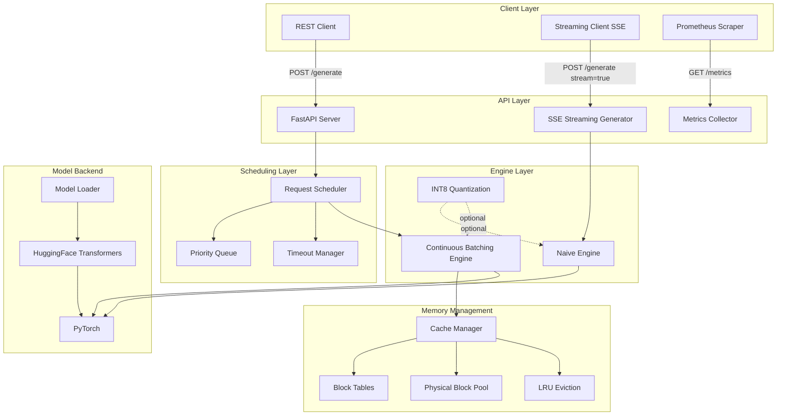
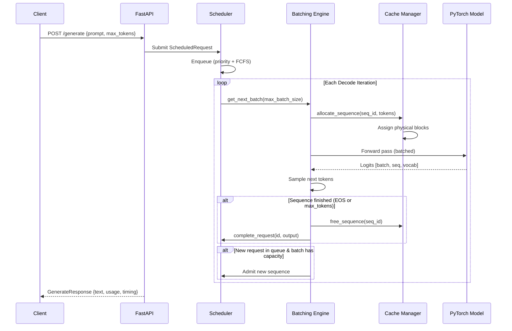
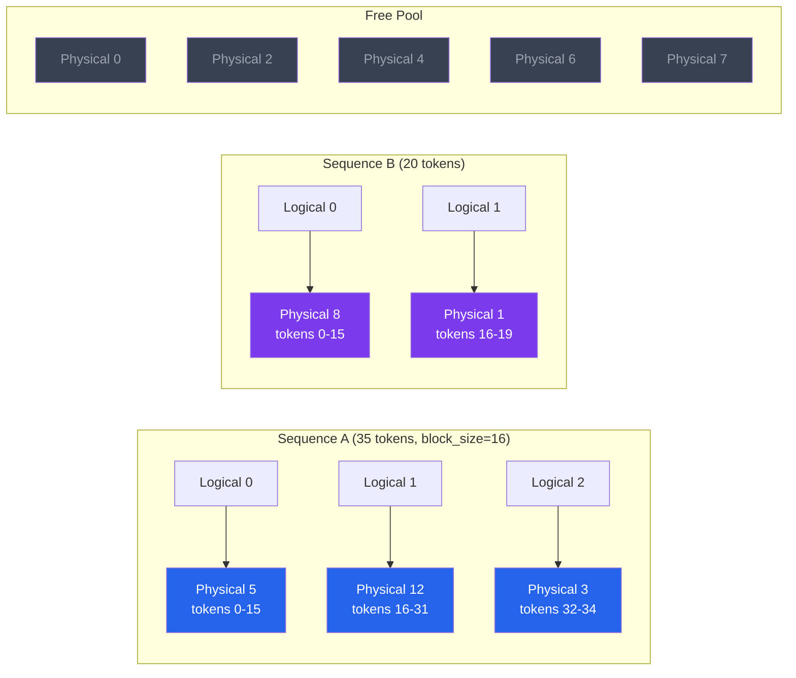

# Architecture

## System Overview



## Request Flow



## KV-Cache Block Management



**Key insight**: Sequences don't need contiguous memory. Physical blocks are allocated from a free pool and mapped via block tables — exactly like virtual memory pages in an OS. This eliminates fragmentation.

## Continuous Batching vs Static Batching

```
Static Batching:
  Time →  ████████████████████████
  Seq A:  ██████████████████████     (22 tokens)
  Seq B:  ██████████████             (14 tokens, 8 slots wasted)
  Seq C:  ████████                   (8 tokens, 14 slots wasted)
  
  New requests must wait until ALL sequences in the batch finish.

Continuous Batching:
  Time →  ████████████████████████
  Seq A:  ██████████████████████     (22 tokens)
  Seq B:  ██████████████ Seq D: █████████
  Seq C:  ████████ Seq E: ████████████████
  
  Finished sequences are immediately replaced by waiting requests.
  GPU stays fully utilized.
```

## Engine Modes

| Feature | Naive Engine | Batching Engine |
|---------|-------------|-----------------|
| Concurrency | 1 request at a time | Up to max_batch_size |
| KV-Cache | Managed by HuggingFace | Block-level management |
| Scheduling | None (synchronous) | Priority queue + FCFS |
| Memory | Uncontrolled growth | Block allocation + LRU eviction |
| Best for | Debugging, baselines | Production throughput |
